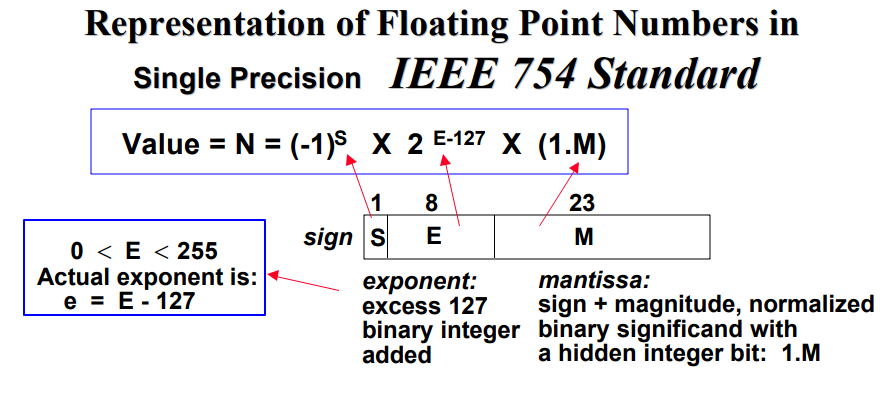

# Rappels

## Systèmes d'équations linéaires

- $A$ : Matrice $nn$ **inversible**
- $b$ : Vecteur de taille $n$

On cherche $x$ vecteur de taille $n$ tel que $Ax = b$

Résolution numérique d'une $EDP$ (équations dérivées partielles)

## Problèmes de moindres carrés

- $A$ : Matrice $nn$
- $b$ : Vecteur de taille $n$

On cherche $x$ vecteur qui minimise $||Ax - b||^2_2$

Ajustement des paramètres d'un modèle, pour être "proche" d'observations

## Problèmes de valeurs/vecteurs propres

- $A$ : Matrice carré

On cherche ($\lambda$, $u_\lambda \neq 0$) tel que $Au_\lambda = \lambda u_\lambda$

_Rappel : calculer le **polynôme caractéristique**, donc savoir calculer un **déterminant**_

- Mode propres de vibration
- Page Rank (Google 1998)
- Projection réduction de dimension
  - POD - Galerkin
- ACP : Analyse en composantes principales

## Décomposition en valeurs singulières

- $A$ : Matrice (grande)

On cherche une matrice $\tilde{A}$ "proche" de $A$, avec $\tilde{A}$ de rang le + petit possible.

Matrice de rang $n$, $\tilde{A} = MM^T$ avec $M$ de taille $n$.

Ca peut servir en **Compression / Débruitage**

_Exemple :_

$A = A_s + bruit \rightarrow$ de rang grand

Avec $A_s$ signal faible rang

## Choix d'une méthode

$\rightarrow$ dépend du type de problème général, mais aussi de particularités :

- Propriétés de $A$ (symétrie par exemple)
- Critères : rapidité, précision, ...
- Et aussi des critères de la machine avec laquelle on calcule (mémoire cache)
  - _BLAS : Basic Linear Algebra System_
  - _ATLAS : Automatically Tuned Linear Algebra Software_
  - Parallélisme (GPU)

## Virgule flottante $IEEE754$

| /                | Signe | Exposant _biaisé_ $e$ | Mantisse |
| ---------------- | ----- | --------------------- | -------- |
| Simple précision | $1$   | $8$                   | $23$     |
| Double précision | $1$   | $11$                  | $52$     |

- Simple précision : représenter des entiers $32$ bits ($e = E - 127$)
- Double précision : représenter des entiers $64$ bits ($e = E - 1023$)

On garde $^*$ une précision relative ($=$ un nombre de chiffres binaires significatifs à chaque opération)

`*` : Sauf overflow ou underflow

Pour **augmenter** la précision, on **baisse** les performances (librairies à précision arbitraires)

## Normes, normes matricielles, conditionnement

$x \in \R^n$

$||x||_p = \sum^n_{i=1} |x_i|^p$

$p = 2$ (norme Euclidienne)

$||x||_\infty = max |x_i|$

Pour tout $||.||$ et $||.||'$, il existe $c_1, c_2$ pour tout $x$

---

$f$ linéaire $\R^n \rightarrow \R^p$

$||f|| = max ||f(x)||$

avec $x \in \R^n$ et $||x|| = 1$

---

Matrice

- $A$ inversible
- $b$ vecteur
- $x$ solution de $Ax = b$

Conditionnement de $A$ : $K(A) = ||A||.||A^{-1}||$

$\tilde{x}$ solution de $Ax = \tilde{b}$

$\frac{1}{K(A)} \frac{||b - \tilde{b}||}{||b||} \le \frac{||x - \tilde{x}||}{||x||} \le K(A)\frac{||b - \tilde{b}||}{||b||}$

Si on a une erreur d'arrondi sur $b$, dans le meilleur des cas, on aura une erreur relative sur $x$, proportionnelle à $K(A)$

$\rightarrow$ On veut éviter d'avoir $K(A)$ grand

## Pivot de Gauss - Décomposition `LU`

- Triangulaire inférieure : données **sous** la diagonale stricte
- Triangulaire supérieure : données **au-dessus** de la diagonale et **diagonale comprise**

$A$ : Matrice carré

$L_i \leftarrow L_i - \frac{a_{i1}}{a_{11}} L_1$ Pour tout $i \gt 1$

Application à la résolution d'un système linéaire

$Ax = b$

$L(Ux) = b$

On trouve $y$ tel que $Ly =b$

Pour trouver $x$, on résout $Ux = y$

Si $L$ est triangulaire inférieure (des 0 au-dessus de la diagonale).

$L$ et $U$ étant triangulaire, la résolution de ces systèmes est immédiates $O(n^2)$

## Problème des moindres carrés

- $A$ : Matrice $mn$ ($n$ colonnes et $m$ lignes)
- $b$ : Vecteur($n$)

$(A^TA)x = A^Tb$

### Factorisation de Choleskey

Si $S$ symétrique et définie positive, alors il exiqte $L$ tel que :

$S = LL^T$

Si connaît $L$ : on peut résoudre $Sx = c$

$L(L^Tx) = c$

On résout $Ly = c$ puis $L^Tx = y$
