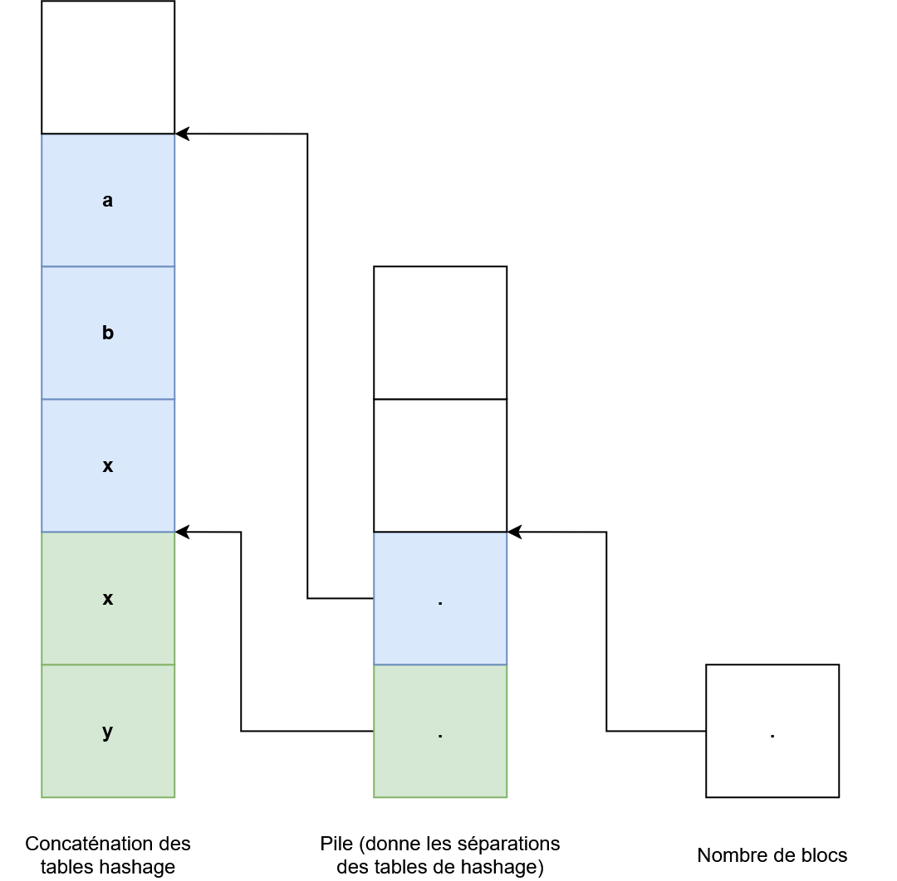

# Tables des symboles

### Version facile

```cpp
enum SymbolType {
    SYM_VARIABLE,
    SYM_FUNCTION
};

struct Symbol {
    SymbolType type;
    int index; // Index of the symbol in the symbol table
};
```

### Declare

Vérifie si j'ai le droit de déclarer une nouvelle variable

Il faut donc vérifier que dans le **bloc courant** il n'y a pas le même nom de variable, sinon il déclenche une erreur.

```cpp
Symbol declare(ident) {}
```

---

### Find

On essaye d'accéder à une variable en particulier, et renvoie le `Symbol` associé, et renvoie une **erreur fatale si pas trouvé**.

```cpp
Symbol find(ident) {}
```

Itérer sur ma pile jusqu'à trouver ce que je cherche.

### Begin

Entrer dans un nouveau bloc

```cpp
begin()
```

`push`

### End

On sort d'un bloc

```cpp
end()
```

`drop`

_Exemple_

```c
{ // begin
    int x; // declare
    x = 3; // find
    { // begin
        debug x; // find
        int x; // declare
        x = 5; // find
        debug x; // find
    } // end
    debug x; // find
} // end
```

Ainsi, on créer une table hashage :

| **Tables de hashage**            |
| -------------------------------- |
| **Table 1** (1er niveau)         |
| `x` $\rightarrow$ `[]`           |
| `y` $\rightarrow$ `[]`           |
|                                  |
|                                  |
| **Table 2** (paramètres)         |
|                                  |
|                                  |
| **Table 3** (variables globales) |
|                                  |
|                                  |
|                                  |

`find` va chercher au sommet de la pile l'identifiant correspondant, si il ne trouve pas, il descend à chaque fois de table (bloc).

La table de hashage peut contenir :

- $n$-**tables** (blocs) (environ $5$/$10$ blocs maximum)
- chaque table $m$-**variables** (moins de $50$ variables en général)

## Autre version


